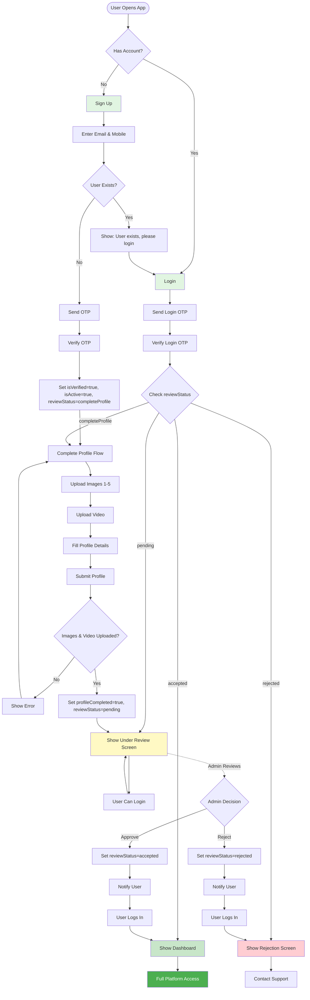
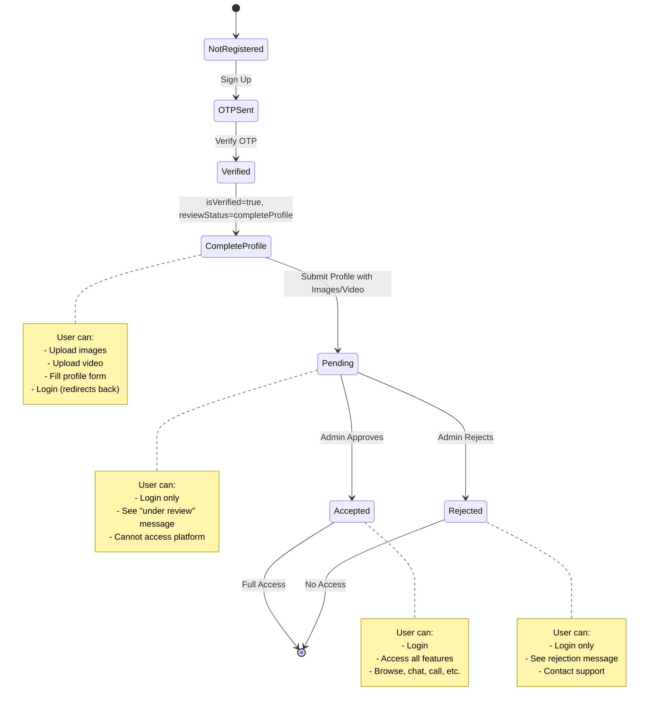
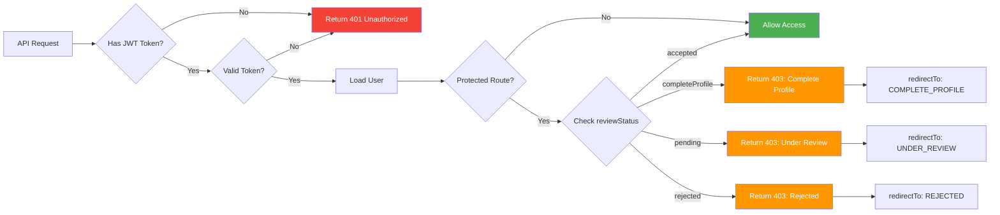
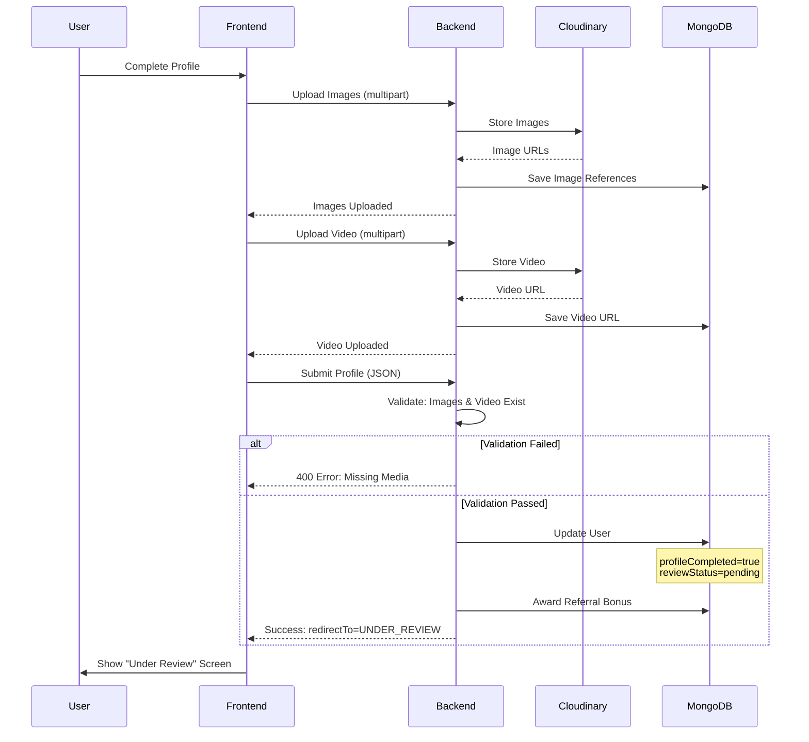
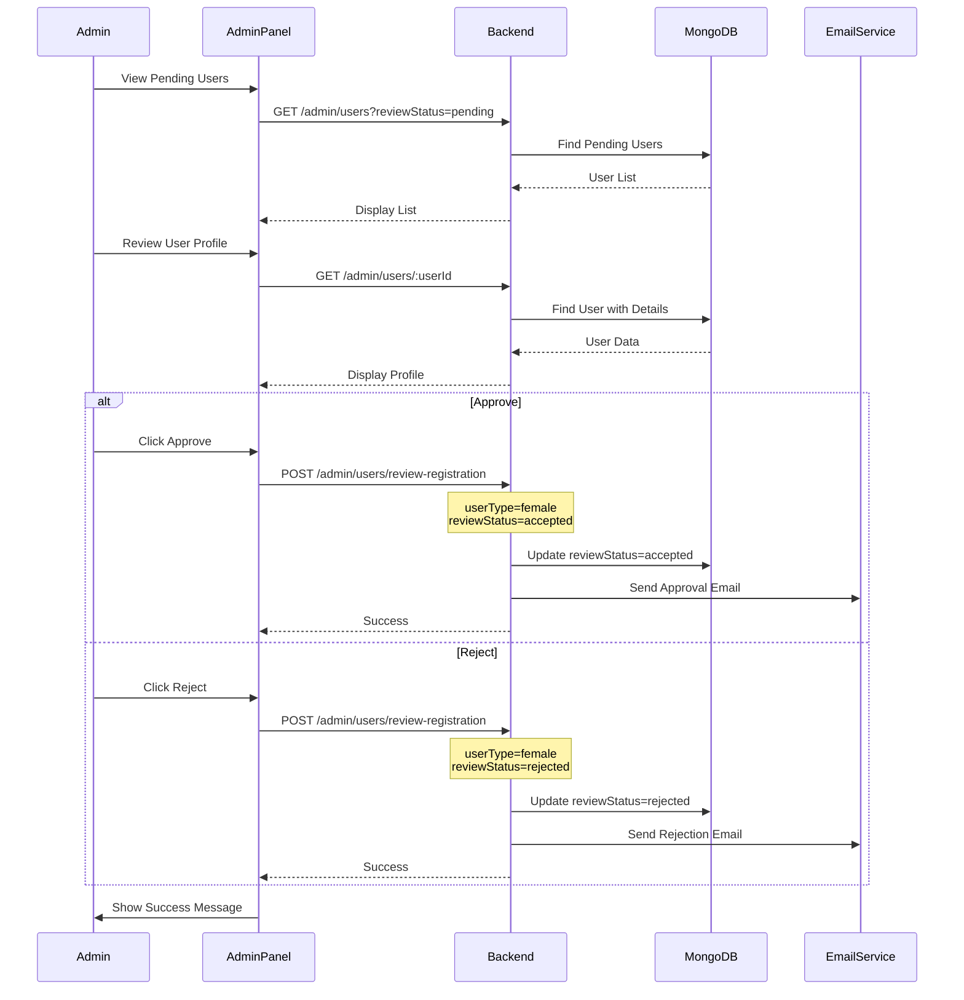
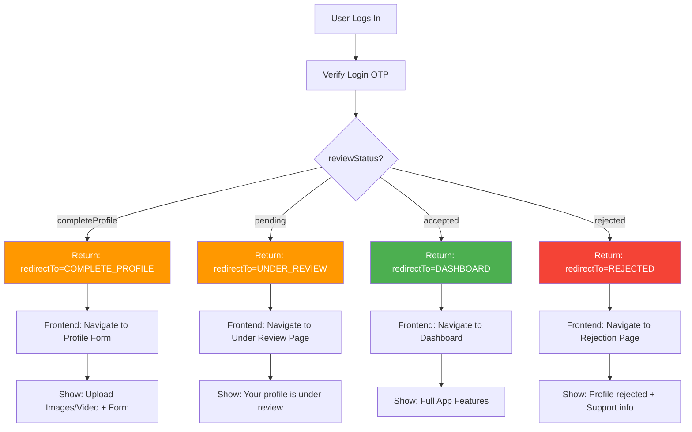

# Female User Authentication Flow Diagram

## Complete User Journey

## State Transition Diagram

## Access Control Flow

## Profile Completion Flow

## Admin Review Workflow

## Login Response Decision Tree

---

## Legend

- **Green** = Success / Allowed
- **Red** = Error / Blocked
- **Yellow/Orange** = Warning / Pending Action
- **Blue** = Information / Process
- **Dotted Line** = Async / Background Process
- **Solid Line** = Synchronous Flow

---

**Note:** These diagrams provide a visual representation of the complete authentication flow. Use them as reference when implementing the frontend or explaining the system to stakeholders.
